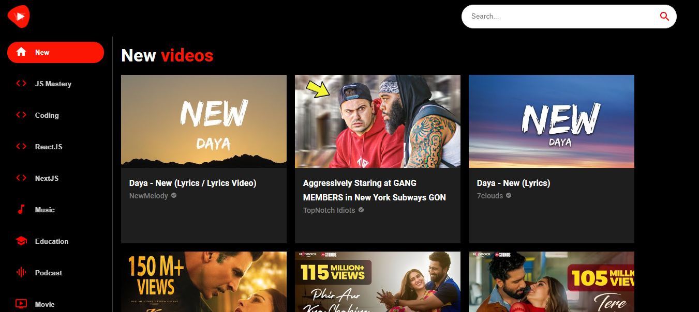

## 📑 Table of Contents
- [🌍 Youtube Clone](#-Youtube-Clone)
  - [🛠 Built With](#-built-with)
    - [🧰 Tech Stack](#-tech-stack)
    - [🔥 Key Features](#-key-features)
  - [🚀 Live Demo](#-live-demo)
  - [💻 Getting Started](#-getting-started)
    - [Prerequisites](#prerequisites)
    - [Setup](#setup)
    - [Install](#install)
    - [Usage](#usage)
    - [Run tests](#run-tests)
    - [Deployment](#deployment)
  - [📧 Contact](#-contact)
  - [🔭 Future Features](#-future-features)
  - [🤝 Contributing](#-contributing)
  - [💖 Show your support](#-show-your-support)
  - [🙏 Acknowledgments](#-acknowledgments)
  - [💎 Useful Resources](#-useful-resources)
  - [📝 License](#-license)


# 🌍 Nation Guide

I am thrilled to share that I have recently built a YouTube clone using React! 🎉 This fully functional application replicates the popular video-sharing platform, allowing users to explore and enjoy a wide range of videos. With features such as video playback, channel subscriptions, and recommended content, my YouTube clone provides an immersive and engaging experience for users. I'm proud of the effort I put into developing this project and excited to showcase my React skills. Check it out and let me know what you think! #ReactDeveloper #YouTubeClone #WebDevelopment



<p align="right">(<a href="#readme-top">back to top</a>)</p>
## 🛠 Built With

### 🧰 Tech Stack

- 
- 
- 
- 

<p align="right">(<a href="#readme-top">back to top</a>)</p>

### 🔥 Key Features
### 🔥 Key Features

- Search Functionality: Implement a powerful search feature to allow users to find specific videos or channels.
- Playlists: Allow users to create and manage playlists of their favorite videos for easy access and organization.
- User Profiles: Provide user profiles to showcase their uploaded videos, playlists, liked videos, and other activities.
- Trending and Popular Videos: Display trending and popular videos to keep users updated with the latest content.
- Accessibility: Ensure your platform is accessible to a wide range of users, including closed captions, subtitles, and support for assistive technologies.

<p align="right">(<a href="#readme-top">back to top</a>)</p>
## 🚀 Live Demo

You can visit the live version of this website on [Youtube Clone App](https://youtube-clone-haal.onrender.com)

<p align="right">(<a href="#readme-top">back to top</a>)</p>  

# 💻 Getting Started

To get a local copy up and running, follow these steps.

### Setup

Clone this repository to your desired folder:

```sh
  cd my-project
  git clone git@github.com:mekuseo/youtube-clone.git .
```

## Install

Install the dependencies with:

```sh
  npm install
```

### Usage

To run the project, execute the following command:

```sh
  npm start
```

### Run tests

To run tests, run the following command:

```sh
  npm run test
```
## Deployment

You can deploy this project using:

```sh
  npm run build
```
This will create a production-ready build of your website in `build/` folder, which you can use to deploy on a static site hosting platform.

<p align="right">(<a href="#readme-top">back to top</a>)</p>

## 📧 Contact 

I am always looking for ways to improve my project. If you have any suggestions or ideas, I would love to hear from you.

[](https://github.com/mekuseo)
[](https://linkedin.com/in/chukwuemekakanu)
[](mailto:mekuseo@gmail.com)

<p align="right">(<a href="#readme-top">back to top</a>)</p>


## 🤝 Contributing 

I welcome any and all contributions to my website! If you have an idea for a new feature or have found a bug, please open an issue or submit a pull request.

Feel free to check the [issues page](../../issues/).

<p align="right">(<a href="#readme-top">back to top</a>)</p>

## 💖 Show your support 

If you like this project, please consider giving it a ⭐.

<p align="right">(<a href="#readme-top">back to top</a>)</p>

<p align="right">(<a href="#readme-top">back to top</a>)</p>


## 💎 Useful Resources

=======
- [Rest Countries API](https://restcountries.com/#api-endpoints-v3-all) - Simple Restful API to get information about all countries
- [CSS Buttons Examples](https://getcssscan.com/css-buttons-examples) - Beautiful CSS buttons
- [Freepik](https://freepik.com/) - Mobile devices mockups

<p align="right">(<a href="#readme-top">back to top</a>)</p>


## 📝 License

This project is [MIT](MIT.md) licensed.

<p align="right">(<a href="#readme-top">back to top</a>)</p>

_NOTE: we recommend using the [MIT license](https://choosealicense.com/licenses/mit/) - you can set it up quickly by [using templates available on GitHub](https://docs.github.com/en/communities/setting-up-your-project-for-healthy-contributions/adding-a-license-to-a-repository). You can also use [any other license](https://choosealicense.com/licenses/) if you wish._

<p align="right">(<a href="#readme-top">back to top</a>)</p>

This project is [MIT](./LICENSE) licensed.

<p align="right">(<a href="#readme-top">back to top</a>)</p>
